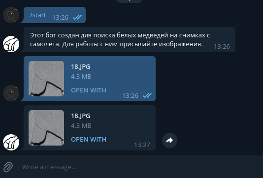

# Bot for find Polar Bears
## Usage
Type /start to start bot

For find bears on image upload image or image file to bot and wait response

## Deploy
1. Create new bot in Telegram [ telegram API](https://core.telegram.org/bots/api)
2. Paste your bots token to config.ini
3. Run [server](https://github.com/BearFinder/api_server.git)
4. Paste server address with /api/ to config.ini

Now, your config.ini looks like this
```
[BOT]
TOKEN=bot_token
[SERVER]
ADDR=http://127.0.0.1:5000/api/
```
5. run main.py for start bot